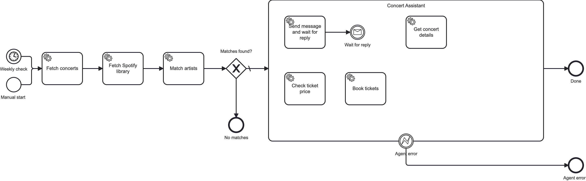

# Camunda Ticket Agent Example

An end-to-end Camunda 8 process built entirely with [Claude Code](https://claude.com/claude-code) (no visual modeler). It finds concerts matching your Spotify library and notifies you through an AI-driven chat conversation.

## What this is

An experiment in AI-assisted Camunda development. The entire project — BPMN XML, workers, connector configuration, and debugging — was done through an AI coding assistant working directly with code rather than the visual BPMN modeler. Built with the [Camunda AI Dev Kit](https://github.com/meyerdan/camunda-ai-dev-kit).

The process:
1. Fetches upcoming concerts in Boston from the Ticketmaster API
2. Pulls your top/saved artists from the Spotify API
3. Cross-references them to find matches
4. If matches are found, an AI Agent (Camunda AI Agent connector + OpenAI) starts a chat conversation via a local web UI
5. The agent can look up concert details, check ticket prices, and book tickets through tool calls

## Architecture



The "Send message and wait for reply" tool is a two-element sub-flow inside the ad-hoc sub-process:
- **Service task** — sends a message to the chat UI and generates a unique correlation key
- **Webhook connector** (`io.camunda:webhook:1`) — waits for the user's reply, correlated by that key

The agent loops through tool calls naturally — no explicit BPMN loop needed.

## Running locally

### Prerequisites

- [Camunda 8 Run](https://docs.camunda.io/docs/self-managed/setup/deploy/local/c8run/) (8.9+)
- Node.js 20+
- API keys (see `.env.example`)

### Setup

```bash
# 1. Copy and fill in your API keys
cp .env.example .env

# 2. Make sure OPENAI_API_KEY is set globally (needed by the connector runtime)
export OPENAI_API_KEY="sk-..."
# Tip: add this to ~/.zprofile so C8 Run always has it

# 3. Install dependencies
npm install

# 4. Start C8 Run
cd /path/to/c8run && ./start.sh

# 5. Deploy the process
c8 deploy resources/concerts-agent.bpmn

# 6. Start workers + chat server
node workers/index.js &
node workers/chat-server.js &

# 7. Start a process instance (skipping to the agent for testing)
curl -s http://localhost:8080/v2/process-instances \
  -H 'Content-Type: application/json' \
  -d '{
    "processDefinitionId": "concerts-agent",
    "startInstructions": [{"elementId": "AgentTools"}],
    "variables": {
      "matchedConcerts": [
        {"name":"Radiohead","date":"2026-04-10","venue":"TD Garden","city":"Boston",
         "performers":["Radiohead"],"matchedArtists":["Radiohead"],
         "priceRanges":[{"min":85,"max":250,"currency":"USD"}],
         "url":"https://ticketmaster.com/radiohead","id":"evt-001"}
      ]
    }
  }'

# 8. Open the chat UI
open http://localhost:3001
```

## Key design decisions

**Unique correlation keys per tool call** — Each "send + wait" cycle generates a UUID-based correlation key. This prevents stale process instances from stealing messages when multiple instances share the same message name (see `dx-feedback.md` Problem 9).

**Webhook connector for inbound messages** — The "Wait for reply" catch event uses Camunda's built-in HTTP webhook connector (`io.camunda:webhook:1`). The chat server POSTs replies to `http://localhost:8086/inbound/whatsapp-reply` with the correlation key and message text. The connector handles message correlation internally.

**Local chat server for development** — `workers/chat-server.js` provides a browser-based chat UI at `localhost:3001` that replaces WhatsApp during development. It renders markdown, streams messages via SSE, and forwards replies to the webhook connector.

## Project structure

```
resources/
  concerts-agent.bpmn     # Main process with AI Agent ad-hoc sub-process
workers/
  index.js                # Worker registration (all workers)
  chat-server.js          # Local chat UI + webhook relay
  fetch-concerts.js       # Ticketmaster API integration
  fetch-spotify.js        # Spotify API integration
  match-artists.js        # Concert/artist cross-reference
  send-whatsapp.js        # Send message tool (agent)
  get-concert-details.js  # Get details tool (agent)
  check-ticket-price.js   # Check price tool (agent)
  book-tickets.js         # Book tickets tool (agent)
docs/
  env-c8run.md            # C8 Run configuration reference
  lang-nodejs.md          # Node.js worker patterns
  camunda-dev-guide.md    # Camunda development guide
dx-feedback.md            # Developer experience findings
```

## DX findings

Building this project surfaced 10 developer experience issues with Camunda 8 when working outside the visual modeler. See [`dx-feedback.md`](dx-feedback.md) for the full writeup, including:

- Undocumented connector input contracts and webhook properties
- Webhook connector version conflicts during iterative development
- Message correlation semantics that surprise developers
- Obfuscated error messages from connectors

## License

MIT
