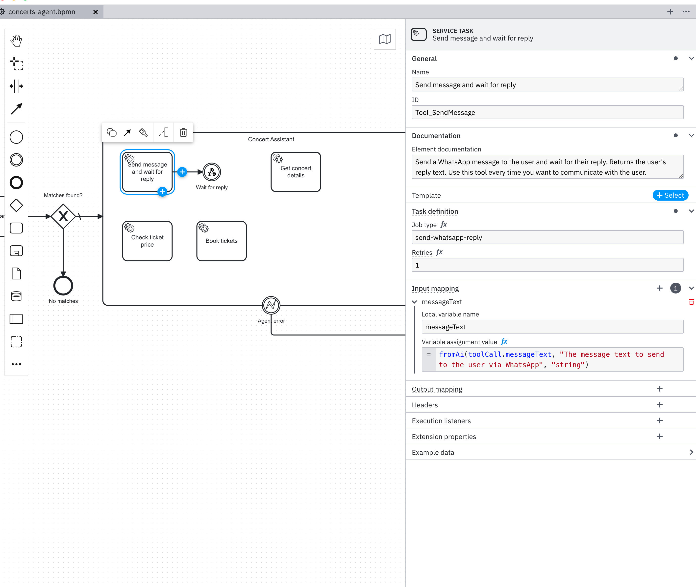
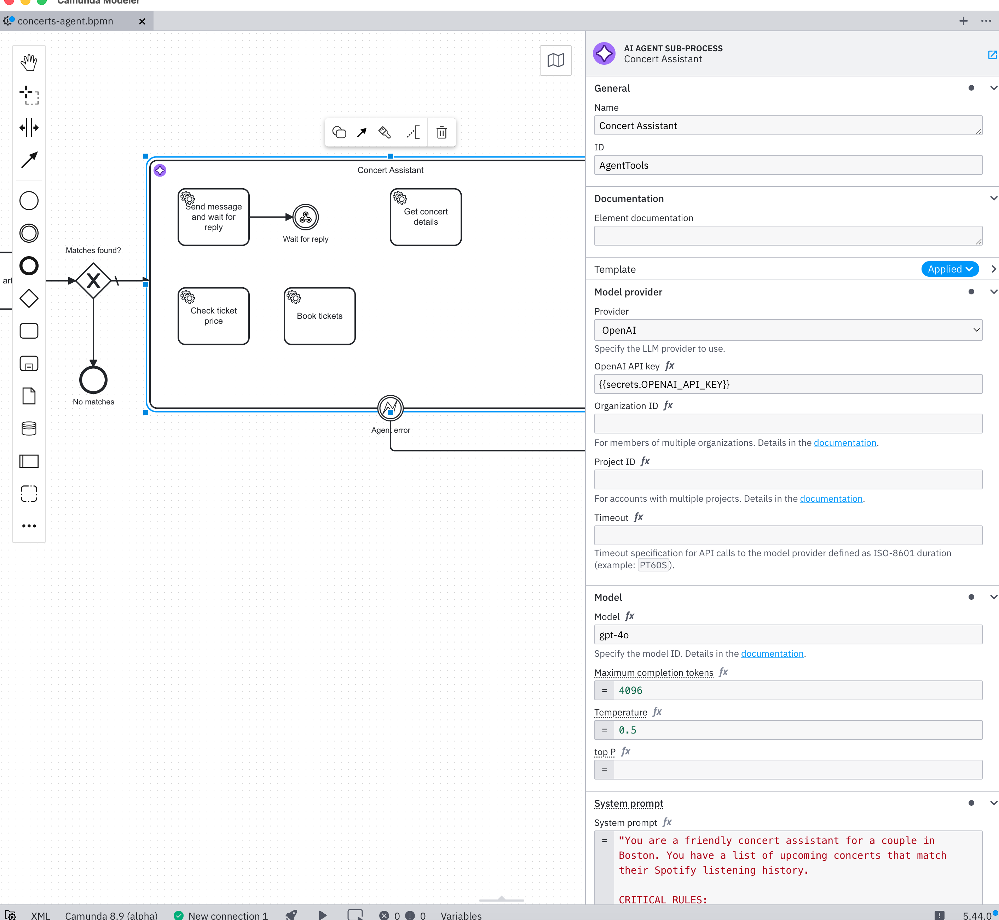
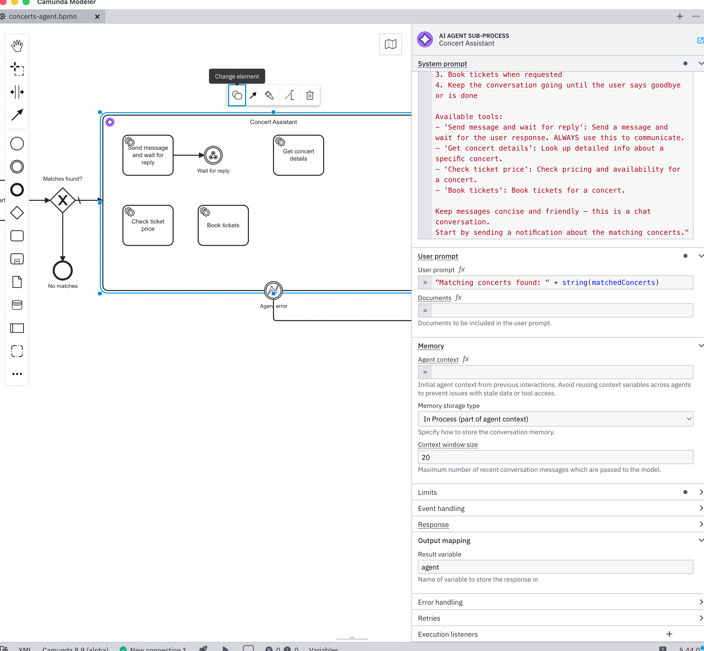
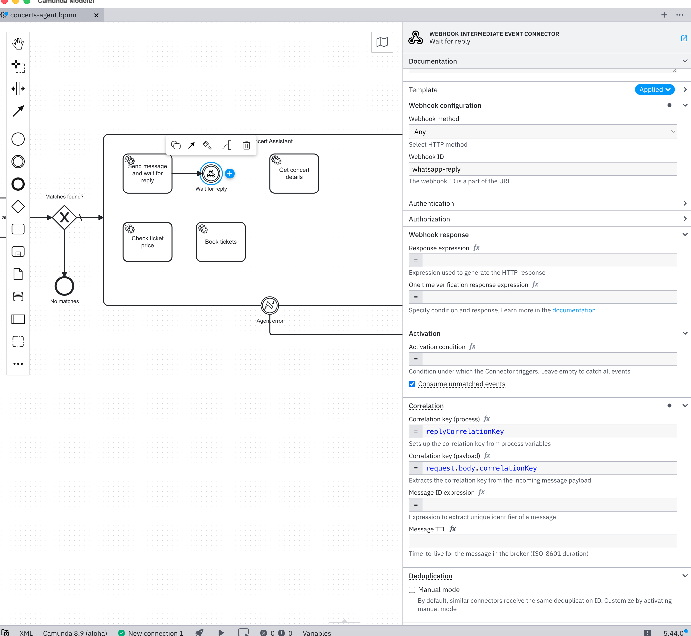

# AI-Assisted Camunda Development: Developer Experience Feedback

## Context

I built an end-to-end Camunda 8 process using Claude Code as an AI coding assistant — no visual modeler involved. The process fetches concerts from Ticketmaster, cross-references with a user's Spotify library, and hands off to an AI Agent (via the Camunda AI Agent connector) that converses with the user over WhatsApp.

This is relevant because AI-assisted development is becoming a primary way developers build software. Claude Code writes BPMN XML, configures connectors, and iterates on errors — much like a developer would using the Modeler, but programmatically. The friction points below are amplified for AI assistants but affect any developer working outside the visual modeler (CI/CD pipelines, IaC, code-first BPMN generation, testing frameworks).

## Summary

Problems are ordered by severity — most urgent first.

| # | Problem | Severity | Fix Complexity | Known Issue? |
|---|---------|----------|----------------|--------------|
| 1 | AI Agent connector not discoverable from problem description | High | Medium (docs + use-case guides) | No |
| 2 | Webhook path conflicts across versions | High | Fixed in alpha5 | Yes — [#3227](https://github.com/camunda/connectors/issues/3227), fixed in 8.9.0-alpha5 ([PR #6056](https://github.com/camunda/connectors/pull/6056)) |
| 3 | Connector input contracts undocumented | High | Medium (auto-generate from templates) | No |
| 4 | AI Agent tool I/O contract hard to figure out | High | Medium (docs + reference page) | No |
| 5 | resultExpression failures indistinguishable from version conflicts | High | Low (logging improvement) | No |
| 6 | Webhook connector properties undocumented | Medium | Medium (same pattern as #3) | No |
| 7 | Enum values hidden in element templates | Medium | Low (add to docs + improve error messages) | No |
| 8 | Duplicate message subscriptions go undetected | Medium | Low (docs + runtime warning) | By design — [documented](https://docs.camunda.io/docs/components/concepts/messages/) but surprising |
| 9 | AI Agent Task vs Sub-process differences unclear | Medium | Low (docs improvement) | No |
| 10 | Connector error messages obfuscated | Medium | Low (likely a bug) | No |
| 11 | Timer processes can't be manually started | Low | Medium (engine change) | No |
| 12 | BPMN XML ordering errors misleading | Low | Medium (validation improvement) | No |

## What the AI did vs. what required human intervention

| Category | AI (Claude Code) | Human guidance needed |
|----------|-----------------|----------------------|
| **Architecture** | Designed an explicit BPMN conversation loop (receive → LLM call → reply → done check → loop) | Recognized the AI Agent connector + ad-hoc sub-process was the right pattern; redirected the AI away from the hand-rolled loop |
| **Sub-flow tools** | Had no model for making a tool "wait" for an external callback | Suggested the two-element sub-flow pattern (service task → receive task) inside the ad-hoc sub-process |
| **Implementation** | Wrote all BPMN XML, workers, connector config, chat server, environment setup | Dev kit provided scaffolding guidance for ad-hoc sub-process structure |
| **Debugging** | Diagnosed webhook version conflicts from connector runtime logs; discovered port 8086 vs 8080; traced misrouted messages to duplicate correlation keys | — |
| **Connector config** | Reverse-engineered `zeebe:properties`, `fromAi()`, `toolCallResult` from element template JSON through trial and error | — |
| **Correlation keys** | Implemented unique keys per tool call after diagnosing the stale instance problem | Pointed out that "target most recent instance" would hide bugs until production; the correct fix is unique keys + warnings |

**The pattern:** The AI is effective at execution — writing code, debugging errors, reading logs, iterating on configuration. But it missed architectural choices that required knowing Camunda's connector catalog and recognizing that a domain-specific abstraction (AI Agent connector) was a better fit than a general BPMN pattern (explicit loop). The [Camunda AI Dev Kit](https://github.com/meyerdan/camunda-ai-dev-kit) and human guidance bridged that gap. This suggests that **dev tooling and documentation are the highest-leverage investments** — when the right pattern is surfaced (via dev kit, docs, or examples), the AI can execute on it effectively.

The highest-leverage fixes are:

1. **Make the AI Agent connector discoverable** from common use-case descriptions, with concrete sub-flow tool examples (Problem 1)
2. **Fix webhook version conflicts** so the latest version always wins during development (Problem 2)
3. **Publish programmatic references** for connector input contracts and webhook properties (Problems 3, 6)
4. **Document the complete tool lifecycle** including `fromAi()`, `toolCallResult`, and webhook interaction patterns (Problem 4)
5. **Improve connector runtime observability** — log which version handles each request (Problems 2, 5)

---

## Problem 1: The AI Agent connector is not discoverable from the problem description

### What happened

When building this project, the initial design used an **explicit BPMN conversation loop**: receive message → call LLM (via `@anthropic-ai/sdk` in a custom worker) → send reply → check if conversation is done → loop back. This is the standard BPMN pattern for iterative interactions and the one an AI coding assistant (or any developer familiar with BPMN but not Camunda's connector catalog) would naturally reach for.

The AI Agent connector with an ad-hoc sub-process — where the agent drives the conversation through tool calls and no explicit loop is needed — was only adopted after a **human** recognized the pattern and pointed the AI assistant to it. The assistant did not discover or suggest the AI Agent connector on its own. Once the architectural direction was set, the [Camunda AI Dev Kit](https://github.com/meyerdan/camunda-ai-dev-kit) provided implementation guidance (scaffolding the ad-hoc sub-process with root-element tools, `fromAi()` parameters, and `toolCallResult` output mapping), but without the human's intervention the project would have shipped with the hand-rolled loop, a direct LLM SDK dependency, and a custom `process-message.js` worker — all unnecessary complexity.

Even after discovering the AI Agent connector, the **sub-flow tool pattern** required a separate hint. The "Send message and wait for reply" tool is not a single service task — it's a two-element sub-flow: a service task (sends the message) connected via sequence flow to a receive task (waits for the reply via webhook). The ad-hoc sub-process detects only root elements (nodes with no incoming sequence flows) as tools, so the agent sees one tool while BPMN executes two steps. This pattern — composing a multi-step tool from connected BPMN elements inside an ad-hoc sub-process — is mentioned briefly in the docs ("You can use any BPMN elements and connectors as tools and to model sub-flows within the ad-hoc sub-process") and in a [blog post](https://camunda.com/blog/2025/11/designing-ai-agents-in-camunda-ai-agent-task-connector-with-loop/) ("the tool is a set of BPMN elements"). But there is no concrete example of a "send and wait" sub-flow, and the AI assistant did not arrive at this pattern on its own — it was only built because it was explicitly suggested. Without that guidance, the assistant had no model for how to make an agent tool "wait" for an external callback.

### Why it matters

- **The problem description doesn't lead to the solution.** A developer thinking "I need a process that has a conversation with a user" will search for "BPMN conversation loop" or "message correlation patterns," not "AI Agent ad-hoc sub-process." The connector solves the problem elegantly, but you have to already know it exists.
- **AI coding assistants are particularly affected.** They pattern-match from training data, which has abundant examples of explicit loops and very few examples of Camunda's agentic connector pattern. Without a dev kit or explicit guidance, they will consistently choose the worse architecture.
- **The ad-hoc sub-process concept is unfamiliar.** Even developers who find the AI Agent connector docs may not understand that "tools are root elements in an ad-hoc sub-process" means they don't need a loop. The mental model shift from "explicit orchestration" to "agent-driven tool calling" needs a bridge.
- **Sub-flow tools are a hidden power feature.** The ability to compose a tool from multiple BPMN elements (service task → receive task, or service task → gateway → multiple paths) is extremely powerful but hard to discover. The "root element = tool entry point" convention is documented briefly, but without a concrete "send and wait" example, developers (and AI assistants) default to assuming each tool must be a single task.
- **The manual approach works but is worse in every way.** The explicit loop required more BPMN elements, a custom worker, a direct LLM dependency, manual context management, and a "done" check gateway. The AI Agent connector eliminated all of this. But "it works" is the enemy of "there's a better way" — developers who build the loop first have little reason to discover the connector later.

### Suggestion

1. **Use-case-based documentation entry points.** Add a "Building conversational processes" or "Adding AI to your process" guide that starts from the problem ("I want my process to have a back-and-forth conversation") and leads to the AI Agent connector — not buried in the connector catalog but linked from the main BPMN patterns / best practices docs.
2. **"Before and after" examples.** Show the explicit loop pattern side-by-side with the AI Agent connector approach, making the simplification immediately visible. This validates developers who built the loop ("you're not wrong") while showing the better path.
3. **Document sub-flow tools with concrete examples.** The docs mention sub-flows are supported and a blog post references "sets of BPMN elements," but there are no step-by-step examples of the most useful patterns. Add a "Sub-flow tool recipes" section to the AI Agent connector docs with examples: send-and-wait (service → catch event), conditional tools (service → gateway → paths), and enrichment chains (service → service). The "send and wait" pattern in particular is critical for any agent that interacts with external systems asynchronously.
4. **Dev tooling that suggests the pattern.** The Camunda AI Dev Kit proved this works — when the `new-agent` skill was available, the right architecture emerged naturally. Integrating similar guidance into the Modeler (e.g., "This loop with an LLM call could be replaced by an AI Agent sub-process") or the docs would have the same effect.

---

## Problem 2: Webhook connector path conflicts across process definition versions

**Likely fixed in 8.9.0-alpha5** — see [#3227](https://github.com/camunda/connectors/issues/3227) / [PR #6056](https://github.com/camunda/connectors/pull/6056). We were running 8.9.0-alpha4.

### What happened

After 13 iterative deployments with changing webhook connector configurations, the connector runtime loaded connectors from multiple versions. An old version (v10) registered on the `whatsapp-reply` path first and became the primary handler; the current version (v13) went to standby. All incoming requests were processed by v10's connector with its outdated activation condition, returning 422. The fix required restarting the connector runtime.

### Remaining suggestion

Even after the alpha5 fix, **log which version is handling a request**. The current log says "Activation condition not met" but doesn't say which process definition version evaluated the condition — this cost significant debugging time.

---

## Problem 3: Connector input contracts are undocumented

### What happened

The AI Agent connector requires specific `zeebe:input` target names like `data.systemPrompt.prompt`, `data.memory.storage.type`, and `provider.openai.authentication.apiKey`. These names are not documented anywhere in the Camunda docs. The documentation describes fields conceptually ("System Prompt", "Memory storage type") but never provides the programmatic field names.

To discover the correct names, I had to download the raw element template JSON from GitHub (`agenticai-aiagent-job-worker.json`) and parse the binding definitions manually.

### Why it matters

- Any developer writing BPMN programmatically (code-first, CI/CD, testing) has no reference for these fields
- AI coding assistants cannot reliably generate correct connector configurations
- The element template JSON is the de facto API contract, but it's treated as an internal implementation detail

### Suggestion

Publish a **Connector Input Reference** for each connector — a table mapping the UI field label to its `zeebe:input` binding name, expected type, valid values, and default. This could be auto-generated from the element template JSON and included in each connector's documentation page. Example:

| UI Label | Binding Name | Type | Valid Values | Default |
|----------|-------------|------|-------------|---------|
| Memory storage type | `data.memory.storage.type` | enum | `in-process`, `document-storage`, `custom` | `in-process` |
| Context window size | `data.memory.contextWindowSize` | number | — | `20` |

---

## Problem 4: AI Agent tool I/O contract (`fromAi` / `toolCallResult`) is hard to figure out

### What happened

The AI Agent connector's tools communicate with the agent through a specific contract: input parameters are declared using `fromAi()` in `zeebe:input` mappings, and the tool's result must be written to a variable named `toolCallResult`. Getting this working required piecing together information from multiple sources:

1. **Declaring tool parameters**: Each tool's input mappings use `fromAi("paramName", "type", "description")` as a FEEL source expression. The connector reads these to build the tool's JSON Schema for the LLM. This function signature — including valid types (`string`, `number`, `boolean`, `object`, `array`) — is not documented outside the element template.
2. **Returning tool results**: The tool must set a variable named exactly `toolCallResult` (not `result`, not `output`, not `response`). For simple workers, this means calling `job.complete({ toolCallResult: "..." })`. For webhook connectors inside the sub-flow, this means writing a `resultExpression` like `={toolCallResult: request.body.text}`. The variable name convention is mentioned in the docs but easy to miss among all the other configuration.
3. **Scope matters**: The `toolCallResult` variable must be set at the right scope — inside the ad-hoc sub-process, not at the process level. Workers do this naturally (they complete the job that activated them), but webhook connector `resultExpression` behavior inside ad-hoc sub-processes was unclear and required experimentation.
4. **The `agent` result variable**: The ad-hoc sub-process itself produces an `agent` result variable containing `agent.context` (conversation memory), `agent.response` (last LLM response), and `agent.toolCalls` (tool call history). This structure is documented but the interaction between `toolCallResult` (per-tool) and `agent` (per-iteration) took trial and error to understand.

### Why it matters

- The `fromAi()` → worker execution → `toolCallResult` → agent loop is the core contract for building AI Agent tools, but it's spread across multiple doc pages (connector config, ad-hoc sub-process, worker patterns)
- The exact variable name `toolCallResult` is a magic string — if you get it wrong, the agent silently receives no result and may hallucinate or retry
- AI coding assistants struggle particularly with this because there's no single reference page showing the complete tool lifecycle with code examples
- The interaction between webhook connector `resultExpression` and the `toolCallResult` convention is not documented at all

### Suggestion

1. **Create a "Tool Lifecycle" reference page** that shows the complete flow in one place: how `fromAi()` declares parameters → how the connector builds the tool schema → how the worker/connector executes → how `toolCallResult` flows back to the agent → how the agent decides the next action. Include code examples for each tool type (simple worker, webhook sub-flow, connector).
2. **Make `toolCallResult` less magic**: Consider accepting the variable name as a configurable property on the ad-hoc sub-process (defaulting to `toolCallResult`), or at minimum, add prominent documentation with a warning: *"Your tool MUST set a variable named `toolCallResult`. Any other name will be silently ignored."*
3. **Add `fromAi()` to the FEEL function reference** with its full signature, valid types, and examples.

---

## Problem 5: Webhook connector `resultExpression` behavior is indistinguishable from version conflicts

**Known issue? No.** No existing bug reports cover this scenario.

### What happened

While debugging the webhook connector inside an ad-hoc sub-process, the `toolCallResult` variable was always empty (`""` or `null`). We tried three different variable mapping approaches:

1. `inbound.variableMapping` — variable not set
2. `inbound.resultExpression` — variable not set
3. `inbound.resultVariable` — variable not created

We concluded that webhook connector variable mapping doesn't work inside ad-hoc sub-processes. This led to replacing the webhook connector with direct Zeebe message correlation (`POST /v2/messages/correlation`), which **did** work.

Later, when revisiting the webhook connector with a clean setup, we discovered the variable mapping **does work** inside ad-hoc sub-processes. The original failures were caused by **Problem 2** — an old version's connector was handling requests, and its different configuration (different result expression, different activation condition) produced empty results. The webhook connector itself was never the issue.

### Why it matters

- The misdiagnosis cost hours of debugging and led to an unnecessary architectural workaround.
- The symptom (empty variables) was attributed to the wrong root cause (ad-hoc sub-process scoping) because there was no visibility into which connector version was actually processing requests.
- This failure mode is particularly insidious: the variable mapping appears broken, but the actual problem is a version conflict in the connector runtime.

### Suggestion

This is a direct consequence of Problem 2. Fixing version priority and improving logging (showing which version handles each request) would prevent this class of misdiagnosis entirely.

---

## Problem 6: No programmatic reference for webhook connector properties

### What happened

Configuring the webhook inbound connector (`io.camunda:webhook:1`) on an intermediate catch event required setting multiple `zeebe:property` entries: `inbound.type`, `inbound.context`, `inbound.method`, `inbound.activationCondition`, `correlationKeyExpression`, `inbound.responseBodyExpression`, etc.

These property names are not listed in the webhook connector documentation. I assembled them from scattered examples and by inferring from the modeler's property panel behavior.

### Why it matters

- Webhook connectors are commonly used in agentic patterns (waiting for external callbacks)
- The `zeebe:property` names are essentially the connector's configuration API
- Without a reference, developers must reverse-engineer the configuration from examples or the modeler

### Suggestion

Apply the same "Input Reference" documentation pattern (see Problem 3) to inbound connectors. Document all `zeebe:property` names, their expected values, and which are required vs optional.

---

## Problem 7: Enum values are hidden in element template dropdowns

### What happened

The memory storage type field requires the exact string `in-process` (with hyphen). I first tried `inProcess` (camelCase), which seemed reasonable. The connector rejected it with a deserialization error but did not indicate the valid values. I had to find the dropdown choices in the element template JSON to discover the correct format.

Similarly, `data.events.behavior` expects a specific enum format that wasn't obvious from the field name alone.

### Why it matters

- Trial-and-error debugging for string enum values is slow
- Error messages confirm a value is wrong but don't suggest correct alternatives
- Inconsistent casing conventions across fields (some camelCase, some kebab-case) make guessing unreliable

### Suggestion

1. Include valid enum values in the connector documentation (see Problem 3)
2. Improve connector validation error messages to list accepted values: *"Invalid value 'inProcess' for data.memory.storage.type. Valid values: in-process, document-storage, custom"*

---

## Problem 8: Duplicate message subscriptions go undetected

**Known issue?** By design — [documented](https://docs.camunda.io/docs/components/concepts/messages/) but surprising.

### What happened

The AI Agent ad-hoc sub-process uses a "Send message → Wait for reply" tool, where "Wait for reply" is a message intermediate catch event. During development, 12+ process instances accumulated from testing — all subscribed to the same message name (`msg-webhook-reply`) with the same correlation key (`local-user`).

When a user replied, Zeebe correlated the message to a **random** active subscription (non-deterministic among instances). The reply went to a stale instance instead of the current one. Messages were silently misrouted with no warning.

The initial instinct was that Zeebe should target the "most recent" or "current" instance. On reflection, this would be **worse**: it would mask the bug during single-developer testing (where "most recent" happens to be correct) and then fail unpredictably in production when multiple users have concurrent instances. If Zeebe silently picked the "right" instance during dev, the broken correlation key design would ship to production undetected.

The real issue is that **static/shared correlation keys are fundamentally wrong** for patterns where multiple instances can coexist. Zeebe's non-deterministic selection is actually the correct behavior — it surfaces the bug early rather than hiding it. What's missing is a **warning** when the situation arises.

This was resolved by implementing unique correlation keys per tool call (`${chatId}-${crypto.randomUUID()}`), where the send-message worker generates the key, passes it to the chat server alongside the message, and the catch event subscribes with it. The webhook connector extracts the key from the incoming request body.

### Why it matters

- **No warning on duplicate subscriptions.** When a new subscription opens with the same message name and correlation key as an existing one, Zeebe silently accepts it. This is the moment the bug could be caught — but nothing flags it.
- **Developers naturally use static keys.** During early development (single instance, single user), a hardcoded phone number or user ID works fine as a correlation key. The problem only manifests when stale instances accumulate or concurrent users appear — by which point the pattern is baked in.
- **The non-deterministic selection is confusing but correct.** The behavior feels wrong ("why did my message go to the wrong instance?") but any alternative (like "most recent") would just hide the bug until production. The docs should help developers understand this rather than leaving them to discover it through failure.
- **The fix is non-trivial.** Unique keys per interaction require a design change: the send step must generate the key, pass it to the external system, and the catch event must subscribe with it. This pattern needs to be taught upfront, not discovered after debugging misrouted messages.

### Suggestion

1. **Emit a runtime warning on duplicate subscriptions.** When a new message subscription opens with the same message name + correlation key as an existing active subscription, log a warning (at least in dev mode): *"Warning: message subscription for 'msg-webhook-reply' with correlation key 'local-user' already exists on process instance 12345. Messages will be delivered to one instance non-deterministically. Consider using unique correlation keys."* This single change would have saved hours of debugging.
2. **Document the unique correlation key pattern prominently** in the message correlation docs and the AI Agent connector docs. Show the complete flow: generate key → send with message → subscribe with key → correlate on reply. This is the correct pattern for any agent that interacts with external systems, and it should be the primary example, not an afterthought.
3. **Explain why "most recent instance" would be wrong.** Developers who hit this issue will instinctively want Zeebe to "just pick the right one." The docs should explain why non-deterministic selection is correct and why unique keys are the real solution — preventing a class of production bugs that "smart" selection would merely hide during development.

---

## Problem 9: AI Agent Task vs Sub-process implementation differences are unclear

### What happened

The AI Agent connector has two implementations:
- **AI Agent Task** (`io.camunda.agenticai:aiagent:1`) — applied to a service task
- **AI Agent Sub-process** (`io.camunda.agenticai:aiagent-job-worker:1`) — applied to an ad-hoc sub-process

Both share most configuration fields but have subtle differences:
- The Task variant requires `data.tools.containerElementId`; the Sub-process resolves tools automatically
- The `agentContext` field is required for Task but optional for Sub-process
- They have separate element template files with slightly different field sets

The documentation describes both implementations but doesn't provide a clear diff of which fields apply to which, or a decision guide for when to use each.

### Why it matters

- Easy to apply the wrong field set and get cryptic validation errors
- Debugging a field mismatch between implementations wastes time
- The recommended approach (Sub-process) should be the prominent one

### Suggestion

1. Add a comparison table to the AI Agent connector overview showing which fields are shared, Task-only, and Sub-process-only
2. Lead with the Sub-process implementation in the docs (since it's recommended) and treat Task as the advanced/alternative option
3. Consider aligning the task definition types to make the distinction clearer (e.g., `aiagent-task:1` vs `aiagent-subprocess:1` instead of `aiagent:1` vs `aiagent-job-worker:1`)

---

## Problem 10: Connector error messages are obfuscated

### What happened

Every error message from the AI Agent connector had each character wrapped in asterisks:

```
***J***s***o***n*** ***o***b***j***e***c***t*** ***c***o***n***t***a***i***n***s***...
```

The decoded message was: *"Json object contains an invalid field: data, memory, storage"*. This encoding made errors very difficult to read, both for humans scanning the Operate UI and for AI assistants parsing incident details.

### Why it matters

- Slows down the debug cycle significantly — you have to mentally decode every error
- Breaks automated error parsing in CI/CD or monitoring tools
- Particularly painful when iterating on connector configuration

### Suggestion

Investigate why connector error messages are being character-encoded this way and fix it. Error messages should be plain text.

---

## Problem 11: Timer-only processes can't be manually started for testing

### What happened

The process uses a timer start event (weekly trigger). During development, I needed to start instances manually for testing. The engine returned `INVALID_STATE` because `createProcessInstance` doesn't support timer-only start events.

The workaround was adding a second (manual/none) start event to the BPMN — purely for testing purposes, cluttering the process definition.

### Why it matters

- Every timer-triggered process needs this workaround during development
- The extra start event must be remembered and removed (or left as tech debt) before production
- Common developer workflow: deploy → manually trigger → observe → iterate

### Suggestion

Allow `createProcessInstance` (and `c8ctl create pi`) to bypass the timer start event for testing purposes, either as a flag (`--force` or `--ignoreTimer`) or by default in development mode. Alternatively, the modeler could automatically add a manual start event in dev builds.

---

## Problem 12: BPMN XML element ordering errors are misleading

### What happened

The BPMN 2.0 XML Schema requires specific element ordering within events. For example, `<bpmn:outgoing>` must appear before `<bpmn:timerEventDefinition>` inside a start event. When violated, the deployment error is:

*"Invalid content was found starting with element 'outgoing'"*

This suggests `outgoing` is invalid, when in reality it's just in the wrong position.

### Why it matters

- Misleading for anyone generating BPMN programmatically
- AI assistants are particularly susceptible to this since they don't memorize XML Schema ordering rules
- The fix is non-obvious: you have to know the BPMN schema's sequence constraints

### Suggestion

Improve the deployment validation error message to indicate ordering issues: *"Element 'outgoing' must appear before 'timerEventDefinition' in startEvent 'StartEvent_Timer'"*. This is a schema validation enhancement that would save significant debugging time.

---

## Closing thoughts

**Camunda's runtime and execution model are strong.** Zeebe's message correlation, the connector runtime, ad-hoc sub-processes, and the AI Agent connector all work correctly. Every problem in this document is about **discoverability, documentation, or observability** — not about broken functionality.

### Which problems are AI-specific vs. universal?

After verifying each problem in the Camunda Modeler, most are **not specific to AI-assisted or code-first development**. The modeler helps with some problems (dropdown enums, element template application) but provides little advantage for others.

**Would hit any developer equally hard — even in the modeler:**
- **Problem 1 (AI Agent connector not discoverable)** — The modeler has a template browser, but if a developer is thinking "I need a conversation loop," they won't search for "AI Agent sub-process." A human might have a slight advantage through webinars, colleagues, or browsing — but that's serendipity, not discoverability.
- **Problem 2 (webhook version conflicts)** — Silent version conflicts during iterative development affect anyone deploying multiple versions.
- **Problem 4 (tool I/O contract)** — The service tasks inside the ad-hoc sub-process have no element template. `fromAi()` is a raw FEEL expression manually typed into the input mapping field. The modeler does provide FEEL autocomplete — but only if you already know that `fromAi()` exists and is the function you need. There's no "tool parameter wizard," no guided form, and no indication on the input mapping panel that this is how agent tool parameters are declared. The `toolCallResult` variable name is equally undiscoverable. This problem is just as hard for a human in the modeler as it is programmatically:

  

- **Problem 5 (resultExpression misdiagnosis)** — The symptom (empty variables) leading to a wrong root cause (scoping bug) would mislead any developer.
- **Problem 8 (duplicate subscriptions)** — Static correlation keys are a natural starting point for any developer. The production failure mode is the same regardless of who wrote the code.
- **Problem 10 (obfuscated errors)** — Character-wrapped error messages are harder for everyone to read.
- **Problem 11 (timer processes)** — Every developer needs to manually trigger timer processes during testing.

**The modeler helps, but doesn't fully solve:**
- **Problem 3 (connector inputs undocumented)** — The modeler's properties panel abstracts binding names into labeled fields with dropdowns. A human in the modeler never needs to know `data.memory.storage.type` — but anyone working outside the modeler (CI/CD, code-first, testing, AI-assisted) has no reference:

  
  

- **Problem 6 (webhook properties)** — The modeler shows labeled fields ("Webhook ID", "Correlation key (process)") that map to undocumented `zeebe:property` names. The modeler abstracts this, but anyone configuring webhooks programmatically must discover the property names independently:

  

- **Problem 7 (enum values)** — A human in the modeler sees dropdowns (e.g., "In Process (part of agent context)" for memory storage type). Anyone else has to find the element template JSON.
- **Problem 9 (Task vs Sub-process)** — The modeler's template selector helps guide the choice, but the docs remain confusing.
- **Problem 12 (XML ordering)** — Only affects programmatic BPMN generation. The modeler handles ordering automatically.

### The real takeaway

**8 out of 12 problems would hit any developer equally hard, even with the visual modeler.** The modeler fully solves only 4 problems (connector input naming, webhook property naming, enum values, and XML ordering) — and only for developers who use it. For the remaining 8, the modeler provides no meaningful advantage.

The problems are not primarily about "code-first vs. modeler" — they're about **documentation, observability, and discoverability gaps that exist regardless of tooling**. The AI Agent tool I/O contract (`fromAi()`, `toolCallResult`) is equally opaque in the modeler as it is in raw XML. Webhook version conflicts are invisible in both. Duplicate message subscriptions go undetected in both. The AI Agent connector is hard to discover in both.

The AI-assisted development angle amplifies these gaps (the AI can't browse, attend webinars, or ask colleagues) but the gaps exist for all developers. Fixing them improves the experience across the board.
